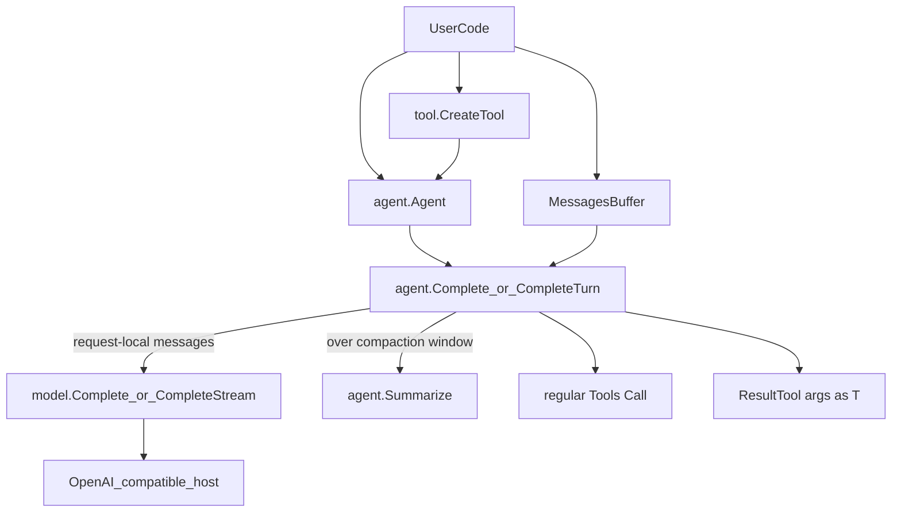
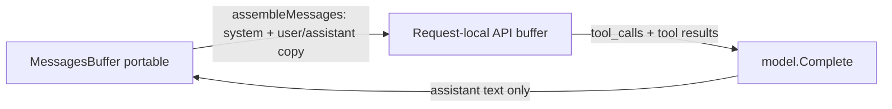

# tiny_agents

The smallest useful OpenRouter agent loop in Go.  
Tools from functions, portable history, typed handoffs. Call `Complete` and move on—no runtime to adopt. Stdlib only.

## Features

- **Call a turn, get a result** — `Complete` / `CompleteTurn`, then you’re done
- **Tools from functions** — reflection builds the schema; you keep writing Go
- **Typed handoffs** — the model fills a struct to finish the turn
- **Portable history** — one buffer moves between agents; prompts and tool traffic stay local
- **Streaming that keeps up** — SSE through tool loops, not only the final reply
- **Compaction when it counts** — summarize from real `prompt_tokens`, not a guess

## Compatibility

| | |
|---|---|
| **Go** | 1.26+ |
| **Dependencies** | Standard library only |
| **Providers** | Typed string names (`model.OpenRouter`, `model.OpenAI`) in `model.Providers`. Custom host via `params.URL` |
| **Auth** | Per-provider env (`OPENROUTER_API_KEY`, `OPENAI_API_KEY`); optional per-call `params.APIKey` |
| **Wire format** | OpenAI-compatible chat messages, function tools, `tool_calls`, and SSE `data:` chunks |
| **OpenRouter extras** | Routing JSON (`ModelParams.Provider`), sticky `SessionID`, default model `openrouter/free` |
| **Models** | Whatever the chosen host serves |
| **Platforms** | Pure Go — wherever the toolchain runs |

Not claimed: multi-provider SDKs (no native Anthropic/Google clients), or a drop-in replacement for the official OpenAI Go SDK.

## Install

```bash
go get github.com/davi-miquelim/tiny_agents@v1.0.0
```

Set an API key for the provider you use:

```bash
# Unix
export OPENROUTER_API_KEY=sk-or-...
# or for Agent.Provider = model.OpenAI
export OPENAI_API_KEY=sk-...

# Windows (PowerShell)
$env:OPENROUTER_API_KEY = "sk-or-..."
```

Per-call overrides (optional):

```go
params, err := model.NewParameters(model.OpenRouter)
if err != nil {
	log.Fatal(err)
}
params.APIKey = "sk-or-other-key" // wins over catalog/env
params.URL = "http://localhost:11434/v1/chat/completions" // custom host
```

Pick a catalog provider on the agent (required):

```go
params, err := model.NewParameters(model.OpenAI)
if err != nil {
	log.Fatal(err)
}
params.Model = "gpt-4o-mini"
a := agent.Agent{
	Provider:    model.OpenAI,
	ModelParams: params,
}
```

The library surface is the `agent`, `model`, and `tool` packages.

Runnable programs (plain chat, tools, multi-turn) live in [`examples/`](examples/).

## Quick start

Typed handoff: the model must call a result tool; arguments become `T`.

```go
package main

import (
	"context"
	"fmt"
	"log"

	"github.com/davi-miquelim/tiny_agents/agent"
	"github.com/davi-miquelim/tiny_agents/model"
	"github.com/davi-miquelim/tiny_agents/tool"
)

type weatherHandoff struct {
	City  string `json:"city" desc:"City name"`
	TempC int    `json:"temp_c" desc:"Temperature in Celsius"`
}

func main() {
	submit, err := tool.CreateTool(
		"Submit the weather handoff fields for this turn. Ends the turn.",
		func(_ context.Context, _ weatherHandoff) (any, error) { return nil, nil },
	)
	if err != nil {
		log.Fatal(err)
	}

	params, err := model.NewParameters(model.OpenRouter)
	if err != nil {
		log.Fatal(err)
	}
	a := agent.Agent{
		Role: "Weather clerk",
		Goals: []string{
			"Return a city and temperature for the user request",
		},
		Instructions: "Put user-facing text in your message. " +
			"Put machine fields only in " + submit.Function.Name + " arguments. " +
			"You must call " + submit.Function.Name + " to end the turn.",
		Provider:    model.OpenRouter,
		ModelParams: params,
		ResultTool:  submit.Tool, // schema only; never Call'd
	}

	buff := &agent.MessagesBuffer{}
	if err := agent.AppendUserMessage(buff, "What's the weather vibe in Lisbon? Use 22C."); err != nil {
		log.Fatal(err)
	}

	// CompleteTurn[weatherHandoff] — type arg ends the turn into res.Data
	complete := agent.CompleteTurn[weatherHandoff]
	res, err := complete(context.Background(), a, buff)
	if err != nil {
		log.Fatal(err)
	}
	fmt.Println(res.Content)
	fmt.Printf("%s: %d°C\n", res.Data.City, res.Data.TempC)
}
```

## Usage

### Chat completion

```go
params, err := model.NewParameters(model.OpenRouter)
if err != nil {
	return err
}
params.Messages = []model.Message{
	{Role: model.System, Content: "You are concise."},
	{Role: model.User, Content: "Say hello in one sentence."},
}
res, err := model.Complete(ctx, model.OpenRouter, params)
```

Streaming:

```go
ch, err := model.CompleteStream(ctx, model.OpenRouter, params)
for chunk := range ch {
	if chunk.Error != nil {
		return chunk.Error
	}
	// read chunk.Choices[i].Delta.Content
}
```

### Tools from Go functions

```go
type addArgs struct {
	A int `json:"a" desc:"First number"`
	B int `json:"b" desc:"Second number"`
}

func addNumbers(_ context.Context, args addArgs) (any, error) {
	return map[string]any{"sum": args.A + args.B}, nil
}

add, err := tool.CreateTool("Add two integers", addNumbers)
// Function name becomes snake_case: "add_numbers"
```

Struct tags: `json`, `desc` / `description`, `enum`, `default`, `required:"false"`.

### Agent turn (`Complete`)

Plain turn with optional executable tools (no typed handoff):

```go
params, err := model.NewParameters(model.OpenRouter)
if err != nil {
	return err
}
a := agent.Agent{
	Role:         "Assistant",
	Goals:        []string{"Help the user"},
	Instructions: "Be brief.",
	Provider:     model.OpenRouter,
	ModelParams:  params,
	Tools:        []tool.CallableTool{add},
}
buff := &agent.MessagesBuffer{}
_ = agent.AppendUserMessage(buff, "Add 2 and 3.")
res, err := agent.Complete(ctx, a, buff)
if err != nil {
	return err
}
if err := agent.DrainComplete(res); err != nil { // no-op when not streaming
	return err
}
```

`MaxToolRounds` defaults to 8. Unknown tools and tool/marshal errors are written back as tool messages so the model can retry; they do not abort the turn.

### Typed handoff (`CompleteTurn`)

When `ResultTool` is set:

- User-facing text goes in assistant message content
- Machine fields go only in the result tool arguments
- The result tool ends the turn (it is not executed as a normal tool)
- Do not mix the result tool with regular tools in the same model step

```go
complete := agent.CompleteTurn[weatherHandoff]
res, err := complete(ctx, a, buff)
// res.Content — user-facing text
// res.Data    — typed handoff
```

### Streaming agent turns

```go
a.Stream = true
complete := agent.CompleteTurn[weatherHandoff]
res, err := complete(ctx, a, buff)
if err != nil {
	return err
}
for chunk := range res.Stream {
	// stream deltas; Content/Data are ready before the channel closes
}
if err := res.Wait(); err != nil { // or agent.DrainTurn(res)
	return err
}
```

For `Complete` with `Stream: true`, drain before the next turn so history is written:

```go
res, err := agent.Complete(ctx, a, buff)
if err != nil {
	return err
}
if err := agent.DrainComplete(res); err != nil {
	return err
}
```

### Context compaction

`Complete` and `CompleteTurn` compact automatically when `MessagesBuffer.Tokens` (last API `prompt_tokens`) reaches the compaction window (default 128000). The latest user message is kept; earlier turns become one `FormatSummary` user message. `Tokens` resets to 0 until the next API turn.

```go
a.Compaction = agent.NoCompaction()
// or
a.Compaction = agent.CompactAt(8_000)
```

`NeedsCompaction` / `Summarize` remain available for custom loops.

## Architecture



### Layers

- **`tool`** — reflection → OpenAI function schemas; executable `CallableTool`
- **`model`** — wire types (`Message`, `Parameters`, streaming chunks), typed `Provider` string catalog, env / per-call auth overlays
- **`agent`** — system prompt assembly, tool rounds, typed `CompleteTurn`, context compaction via summarizer

### Two-buffer pattern

Each turn uses two message buffers so history stays agent-agnostic:



- **Portable buffer** (`MessagesBuffer`) — user + assistant text only; shared across agents; tracks `Tokens` from the last API usage
- **Request-local buffer** — built per turn via `assembleMessages`; holds the system prompt, tool calls, and tool results; never written back into portable history
- **Next turn** — the model sees prior assistant text, not prior `tool_calls` or tool results. Put anything the next turn needs in that assistant text.
- **Handoff** — `ResultTool` schema is sent to the API but not executed; arguments decode to `T`

## Packages

| Package | Role |
|---------|------|
| [`agent`](agent/) | Agent config, `MessagesBuffer`, `Complete` / `CompleteTurn`, summarizer |
| [`model`](model/) | Messages, `Parameters`, auth, `Complete` / `CompleteStream` |
| [`tool`](tool/) | Tool schemas and `CreateTool` |

## Design

- Functions over methods-as-framework: `agent.Complete(ctx, a, msgs)`
- Config structs (`Agent`, `Parameters`) you mutate, not option-func chains
- Generics for typed handoffs (`CompleteTurn` with a type argument)
- Cooperative tool timeouts via `context` (`ToolTimeout`, default 30s)
- Intentionally small surface area—prefer composing packages over extending the core

## Development

Unit tests use httptest mocks and need no API key:

```bash
go test ./...
```

Live OpenRouter checks (skips if the key is unset):

```bash
go test -tags=integration ./agent -run TestIntegration -count=1
```

Package examples:

```bash
go test ./tool ./model ./agent -run Example
```

## Status

**v1.0.0.** The public API is the `agent`, `model`, and `tool` packages.

## License

MIT — see [LICENSE](LICENSE).
